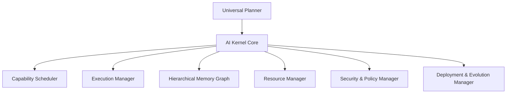
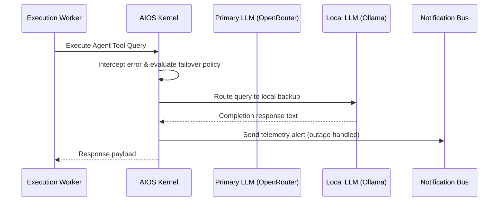

# NovaFlow AI Operating System (AIOS)
## Universal Autonomous Solution Composer Constitution (v12.1)

---

## 1. AI Kernel Architecture
The AI Kernel is the permanent control plane of NovaFlow AIOS. Every event, capability execution, schedule routing, credential lookup, and deployment lifecycle must pass through the kernel interface.



### Core Subsystems
1. **Universal Planner**: Builds the Solution Graph from goals.
2. **Capability Scheduler**: Schedules workloads (Realtime, Batch, Streaming, Cron, Event-Driven).
3. **Execution Manager**: Coordinates runtime workers and intercepts exceptions.
4. **Memory Manager**: Controls the hierarchical memory graph and data access rules.
5. **Security & Policy Manager**: Enforces SOC2, GDPR, and path isolation constraints.
6. **Evolution Manager**: Monitors execution performance to refactor and optimize system designs.

---

## 2. Universal Memory Architecture
NovaFlow AIOS implements a structured, hierarchical memory graph with explicit permission boundaries, TTL retention rules, and AES-256-GCM encryption:

```
[Global Memory]         - Global capability logs (Anonymized)
       │
[Organization Memory]  - Org templates, schemas, and credentials
       │
[Workspace Memory]     - Workspace configurations and secrets
       │
[Solution Memory]      - Solution Graph structures and logs
       │
[Agent Memory]         - Agent conversation history and tool traces
       │
[User Memory]          - User preferences and specific feedback logs
```

---

## 3. Project Graph Schema
The **Project Graph** is the root object mapping the business objectives to their technical execution structures:

```json
{
  "project_id": "proj_hr_onboarding",
  "business_goal": "Automated onboarding pipeline for new hires",
  "solution_graph_ref": "sg_hr_002",
  "dependency_graph": {
    "nodes": ["db_employees", "agent_hr_helper", "wf_contract_sig"],
    "edges": [
      { "from": "agent_hr_helper", "to": "db_employees" },
      { "from": "db_employees", "to": "wf_contract_sig" }
    ]
  },
  "deployment_graph": {
    "target": "aws_ecs_fargate",
    "version": "v3.1.2",
    "health_check_url": "/api/v1/health"
  }
}
```

---

## 4. Business Ontology Engine
The platform includes built-in domain dictionaries mapping processes, terminology, rules, and KPIs:

* **Retail / CRM**: Lead scoring, checkout paths, customer cart triggers, inventory tracking.
* **DevOps / Incident Management**: Prometheus scrapers, log parsing rules, Docker health alerts, Slack paging.
* **HR / Recruiting**: Onboarding steps, signature collection, background checking integrations.

---

## 5. Resource Planner & Scheduler
* **Resource Planner**: Autonomously estimates target hardware profiles (VRAM, storage, CPU cores, active queue threads) required for executing the solution.
* **Resource Scheduler**: Directs tasks into specific execution queues:
  * **Realtime**: Prompt streaming and live API calls (Fast celery workers).
  * **Batch / Background**: Vector RAG generation, media conversions (Heavy worker pools).
  * **Cron / Scheduled**: Automated reports (Celery Beat queue).

---

## 6. Capability & Solution DNA
* **Capability DNA**: Defines structural schemas (inputs, outputs, dependencies, latency constraints, default providers, failover targets, and unit tests) for all reusable assets.
* **Solution DNA**: Stores the full architecture configurations, build dependencies, security policies, test outputs, and deployment history parameters for every system compiled by the composer.

---

## 7. Pattern Mining & Evolution Engine
* **Pattern Mining Engine**: Scans telemetry logs to identify high-efficiency routing sequences, caching configurations, and prompt paths, promoting them as new global templates.
* **Evolution Engine**: Executes self-refactoring loops:
  ```
  [Identify Outage/Latency Peak] ──► [Select Faster Model Variant] ──► [Run Simulated Tests] ──► [Hot Swap Route]
  ```

---

## 8. Digital Employee Framework
Agents are upgraded to **Digital Employees** possessing defined parameters:
- **Role & Title**: (e.g., "QA Auditor").
- **Assigned Projects**: Associated workspace permissions.
- **Skills Registry**: List of authorized system tools (e.g., `file_peek`, `shell_run`).
- **KPI Metrics**: Success percentage, token spend caps, and average resolution times.

---

## 9. Digital Twin 2.0 Simulation
Prior to active production deployment, every Solution Graph undergoes a simulated validation run inside a mock workspace environment:
* **Mock Traffic Injectors**: Generates thousands of mock user events.
* **Error Injectors**: Forces network timeouts and API 429 status codes.
* **Attack Simulator**: Attempts directory traversals or prompt injections to check validation rules.

---

## 10. Runtime Optimizer & Event Intelligence
* **Runtime Optimizer**: Inspects streaming completions to optimize token counts, cache prompts, route requests, and adjust retriever top-$K$ factors.
* **Event Intelligence**: Translates errors, pipeline successes, and latency logs into anonymized training patterns for future solution routing designs.

---

## 11. Database Schema Extensions

```sql
CREATE TABLE project_graphs (
    id VARCHAR(36) PRIMARY KEY,
    name VARCHAR(120) NOT NULL,
    business_goal TEXT NOT NULL,
    solution_payload JSON NOT NULL,
    version_tag VARCHAR(32) NOT NULL DEFAULT '1.0.0',
    created_at TIMESTAMP DEFAULT CURRENT_TIMESTAMP
);

CREATE TABLE platform_telemetry (
    id BIGINT AUTO_INCREMENT PRIMARY KEY,
    project_id VARCHAR(36) NOT NULL,
    event_type VARCHAR(64) NOT NULL,
    latency_ms INTEGER NOT NULL,
    token_count INTEGER DEFAULT 0,
    success BOOLEAN NOT NULL DEFAULT TRUE,
    created_at TIMESTAMP DEFAULT CURRENT_TIMESTAMP
);
```

---

## 12. Solution Composer APIs
* `POST /api/v1/aios/project`: Submits a high-level goal to build a new Project Graph.
* `GET /api/v1/aios/project/[id]/status`: Returns compilation logs, health metrics, and pending JIT credential requests.
* `POST /api/v1/aios/project/[id]/rollback`: Rolls back the active system build to a previous version.

---

## 13. Sequence Diagram (Failover Routing)


