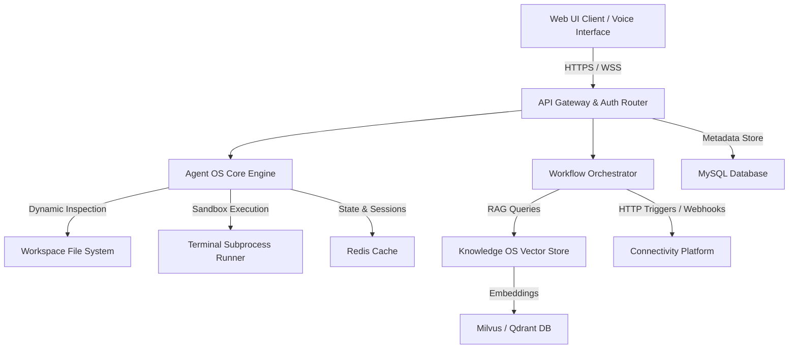

# NovaFlow AI: Complete Product User Manual
### Enterprise Production Edition (v2.4.0)

---

## Document Control
* **Document ID**: NF-UM-2026-V2.4
* **Version**: 2.4.0
* **Classification**: Public / Official Onboarding Documentation
* **Last Updated**: August 1, 2026

### Revision History

| Version | Date | Authors | Description of Changes |
| :--- | :--- | :--- | :--- |
| 1.0.0 | 2025-10-12 | Product Management Team | Initial Release for Core Platform. |
| 2.0.0 | 2026-03-04 | Architecture & QA Leads | Updated for Workflow Builder v2 & AgentOS integration. |
| 2.4.0 | 2026-08-01 | Customer Success & DevSecOps | Removed legacy toy agents; integrated developer-centric code-peeking, file editing, and terminal execution capabilities. |

---

## Table of Contents
1. [Introduction](#1-introduction)
2. [Platform & Architecture Overview](#2-platform--architecture-overview)
3. [Navigation & Interface Framework](#3-navigation--interface-framework)
4. [Page-by-Page Documentation](#4-page-by-page-documentation)
5. [Workflow Builder Canvas & Logic](#5-workflow-builder-canvas--logic)
6. [AgentOS: Autonomous Specialist Registry](#6-agentos-autonomous-specialist-registry)
7. [KnowledgeOS: Structured Context & RAG Engine](#7-knowledgeos-structured-context--rag-engine)
8. [Voice Intelligence & Hands-Free Control](#8-voice-intelligence--hands-free-control)
9. [Connectivity Platform & Webhooks](#9-connectivity-platform--webhooks)
10. [Notification Platform & Alert Routing](#10-notification-platform--alert-routing)
11. [Workspace Settings & Team Management](#11-workspace-settings--team-management)
12. [Marketplace & Template Catalog](#12-marketplace--template-catalog)
13. [Model Lab & Inference Optimizer](#13-model-lab--inference-optimizer)
14. [Status, Icon, and Error Reference Directory](#14-status-icon-and-error-reference-directory)
15. [Real-World Business Use Cases](#15-real-world-business-use-cases)
16. [Frequently Asked Questions (FAQ)](#16-frequently-asked-questions-faq)
17. [Glossary & Reference Index](#17-glossary--reference-index)

---

## 1. Introduction
Welcome to NovaFlow AI. NovaFlow is a next-generation Enterprise AI orchestration platform designed to bridge the gap between Large Language Models (LLMs) and real-world system workflows. 

Unlike traditional chatbot assistants, NovaFlow is an active workspace where developers and business operators design complex multi-step processes, seed specialized agents capable of interacting directly with repository files, maintain structured RAG (Retrieval-Augmented Generation) pipelines, and control systems using integrated voice or REST operations.

This manual serves as the single source of truth for onboarding users, configuring workflow canvases, executing agent tools, and optimizing enterprise operations.

---

## 2. Platform & Architecture Overview

### High-Level Components
* **User Interface Layer**: Built using React/Next.js to provide a glassmorphic, responsive client interface running in the browser. It integrates Web Audio API for real-time voice command processing.
* **AgentOS Services Core**: The execution pipeline that matches user prompts, selects appropriate developer-grade tools, and executes them inside an isolated workspace context.
* **Workflow Orchestration Engine**: Operates directed acyclic graphs (DAGs) representing workflows, executing nodes sequentially, handling retry states, and validating edge constraints.
* **KnowledgeOS RAG Engine**: Manages collection structures, splits documents into overlapping token chunks, maps them to vector spaces via embedding models, and resolves user queries via dense vector searches.
* **Connectivity Hub**: Connects external OAuth channels (GitHub, Slack, Discord, Jira) and processes webhook payloads back to workflow triggers.

---

## 3. Navigation & Interface Framework
The platform navigation is built around a persistent left-sidebar layout in a unified **Workspace Page Shell**.

### Navigation Sidebar Elements
1. **Workspace Switcher (Dropdown)**:
   * *Location*: Top-left sidebar corner.
   * *Purpose*: Access different organization workspaces.
   * *Usage*: Click to list personal, team, or sandbox workspaces. Requires membership in the selected tenant space.
2. **Tab Navigators**:
   * **Chat** (`/chat`): Direct interface with general assistant models.
   * **Apps** (`/apps`): Create and configure custom front-end assistants.
   * **Agents** (`/agents`): Load, create, and test tool-augmented agents.
   * **Workflows** (`/workflows`): Studio canvas to build, publish, and inspect automated workflows.
   * **Knowledge** (`/knowledge`): Upload files, link databases, and query collections.
   * **Model Lab** (`/model-lab`): Route models, run benchmarks, and monitor fine-tuning.
   * **Settings** (`/settings`): Control organization members, SMTP mail settings, API tokens, and team variables.

---

## 4. Page-by-Page Documentation

### 4.1 Chat Page (`/chat`)
* **Purpose**: Primary chat interface for conversational interaction with RAG-enhanced assistants.
* **Sidebar Panel**: Lists active threads, allowing users to rename, branch, or delete conversations.
* **Main Chat Pane**:
  * Displays message history bubble cards.
  * *Prompt Textarea*: Input box at bottom. Supports drag-and-drop file uploads, markdown syntax, and voice-to-text conversion.
  * *Voice Microphone (Button)*: Bottom-right inside input box. Green pulse highlights active recording status.
* **States**:
  * *Loading*: Symmetrical pulse rings indicating the LLM is generating token streams.
  * *Error*: An inline red alert card displaying the failure reason alongside a "Support Reference ID" mask.

### 4.2 Workspace Agents Page (`/agents`)
* **Purpose**: Sandbox page for designing, configuring, testing, and saving autonomous developer agents.
* **Page Layout**:
  * **Configure Run Panel (Left Column)**:
    * *Agent Name Input*: Set agent name (e.g., "GitHub PR Reviewer"). Save button registers it in the DB.
    * *Tools Checklist*: Check boxes to toggle agent permissions for tools (e.g., `file_peek`, `shell_run`).
    * *System Prompt Area*: Multi-line text field describing the agent's role instructions. Includes preset pill buttons at the top to load default system structures.
  * **Response Pane (Right Column)**:
    * *Tool Trace List*: Renders a step-by-step collapse panel showing the tool name, arguments, and return value output generated during agent loops.
    * *Final Output*: Renders the final synthesized markdown response.

---

## 5. Workflow Builder Canvas & Logic
The Workflow Builder (`/workflows/[id]`) is the drag-and-drop studio where developers author automation pipelines.

### 5.1 Canvas Interface
* **Grid Layout**: A dot-patterned vector canvas using mouse drag to pan and mouse wheel to zoom.
* **Nodes**: Rectangular visual cards containing:
  * Node header (icon, title, status indicator).
  * Configuration input parameters.
  * Left-side Input handles and right-side Output handles.
* **Edges**: Vector bezier curves connecting an output handle of a source node to the input handle of a target node.

### 5.2 Supported Node Catalog

| Node Class | Icon | Inputs | Outputs | Behavior / Configuration |
| :--- | :--- | :--- | :--- | :--- |
| **Webhook Trigger** | 🔌 | None | Payload | Listens on a unique `/api/v1/webhooks/[id]` endpoint. Emits parsed JSON when hit. |
| **Agent Node** | 🛠️ | Goal | Response | Selects an agent from the database, executes its configured tool list, and returns final answer text. |
| **Human Review** | 👤 | Input Text | Decision, Comment | Pauses workflow execution. Generates an email notification to the reviewer with Approve/Reject buttons. |
| **Condition Node** | 🔀 | Comparison Value | True branch, False branch | Evaluates variable matches, regex rules, or numeric ranges to route logic. |
| **SMTP Mail Node** | ✉️ | Recipient, Body | Status Code | Sends an HTML/text message using organization SMTP setups. |

### 5.3 Publishing & Execution Lifecycle
1. **Validate**: Click the **Validate Canvas** button in the top-right toolbar. Checks for disconnected inputs, cycles (infinite loops), or empty required fields.
2. **Publish**: Click **Publish Version**. Generates an active API deployment instance.
3. **Execution Tracker**: Shows execution traces: green nodes are completed, yellow in progress, red failed with details.

---

## 6. AgentOS: Autonomous Specialist Registry
AgentOS is the core engine running our seeded developer agents. It allows LLMs to interact directly with the project workspace using sandboxed system tools.

### 6.1 Unified Tool Registry
Agents can be equipped with the following 9 professional developer-grade tools:

1. **`file_peek`**: Reads the text content of files in the project repository safely. NORMALIZES path targets to the workspace path and blocks access to sensitive directories (`.git`, `keys/`, `.env`).
2. **`dir_list`**: Lists the files and subfolders under any project directory recursively (up to 60 items per call).
3. **`file_write`**: Writes or updates code files in the repository. Creates parent folders if missing.
4. **`shell_run`**: Executes terminal shell commands (e.g. `pytest`, `npm run build`) in the workspace and returns exit codes + stdout/stderr. Destructive commands (like `rm -rf /`) are blocked.
5. **`kb_search`**: Vector search over linked KnowledgeOS bases.
6. **`web_fetch`**: HTTP client to extract plain text from public URLs (SSRF protected).
7. **`regex_extract`**: Runs a regular expression pattern search over input strings to locate logs, IDs, or timestamps.
8. **`json_parse`**: Parses raw string blocks into structured JSON dictionaries.
9. **`datetime`**: Fetches the current UTC timestamp.

### 6.2 Seeded Agent Profiles
Six default agents are pre-seeded in the database:
* **GitHub Pull Request & Issue Reviewer**: Analyzes submissions, writes code fixes, and executes test suites.
* **DevOps & Incident Responder**: Inspects server configurations, updates parameters, and parses log outputs.
* **Database Schema & SQL Optimizer**: Analyzes database migrations and runs query execution explain plans.
* **API Integration & Webhook Engineer**: Inspects router files, maps data formats, and tests endpoints.
* **Security & Dependency Auditor**: Audits lockfiles, checks library ranges, and runs security scans.
* **Log Parser & Performance Analyst**: Scans profile traces, runs benchmarks, and isolates bottlenecks.

---

## 7. KnowledgeOS: Structured Context & RAG Engine
KnowledgeOS coordinates Document Storage, Embeddings, and Dense Vector Retrieval.

### 7.1 Data Upload & Processing Pipeline
1. **Upload**: User uploads files (PDF, TXT, DOCX, MD) via the **Knowledge Page** upload card.
2. **Chunking**: The document is split using a sliding window algorithm. Default: 600 characters per chunk, with an 80-character overlap to preserve semantic context across chunk edges.
3. **Embedding Generation**: Chunks are processed by the active text-embedding model (e.g., `text-embedding-3-small`).
4. **Vector Sync**: Embedded vectors are indexed in the vector database (Milvus/Qdrant) under a partition key associated with the `knowledge_base_id`.

### 7.2 Retrieval & Query Tuning
* **Similarity Threshold**: Sets the minimum score (cosine distance or dot product) required to return a chunk.
* **Max Retrieve Count ($K$)**: Determines how many top chunks (typically 3 to 7) are attached to the prompt context.

---

## 8. Voice Intelligence & Hands-Free Control
NovaFlow features Web-Audio based voice control.

### 8.1 Usage & Triggering
* **Mic Activation**: Toggle the microphone button in the input pane or press the hotkey (`Alt + V`).
* **Intent Detection**: The audio stream is transcribed via Whisper/Speech-to-Text and parsed by the intent engine.
* **Workflow Voice Actions**:
  * *"Run Workflow [Name]"*: Triggers immediate background execution of a saved pipeline.
  * *"Navigate to [Page]"*: Performs client-side routing change to the specified page (e.g., "Navigate to settings").
  * *"Pause run"* / *"Resume run"*: Pauses or resumes an in-progress Human Review node.

---

## 9. Connectivity Platform & Webhooks
The Connectivity Platform integrates external tools into NovaFlow workflows.

### 9.1 Supported Connectors
* **GitHub**: Uses OAuth. Listens to PR creations, commits, or issue openings, sending payloads directly to Webhook Trigger nodes.
* **Slack / Discord**: Post formatted rich messages into channels. Supports dynamic variables parsed from preceding workflow nodes.
* **Jira**: Creates tickets automatically upon workflow failure or DevOps responder flags.

---

## 10. Notification Platform & Alert Routing
The platform handles notifications through multiple channels.

### 10.1 UI Indicators
* **Notification Bell**: Positioned in the top navigation header bar.
* **Unread Count Badge**: Red circular bubble count showing outstanding actions (like pending Human Reviews).

### 10.2 Channel Configuration
* **Slack / Discord Integration**: Webhook URL configurations in Workspace Settings route prioritized messages instantly.
* **SMTP Mail delivery**: Workspace admins configure mail delivery templates with customized CSS layouts to avoid SPAM filters.

---

## 11. Workspace Settings & Team Management
Manage users, access permissions, organization settings, and credentials.

### 11.1 Team Settings & Invites
* **Invite Team Member**: Send an invitation email using the SMTP configuration. Generates a registration link.
* **Security Tab**:
  * Configure session timeouts.
  * Enforce complex password histories (cannot reuse the last 5 passwords).

### 11.2 RBAC Roles (Role-Based Access Control)
* **Owner**: Full workspace access, billing configuration, workspace deletion.
* **Editor / Developer**: Create, modify, and delete workflows, knowledge bases, and agents. Run commands.
* **Viewer**: View executions, converse with published assistants. Cannot change configurations or execute write tools.

---

## 12. Marketplace & Template Catalog
Allows workspaces to import, export, and clone preconfigured assets.

### 12.1 Standard Workflows & Installation
* Browse the catalog cards under the `/marketplace` directory.
* Click **Clone to Workspace** to copy the complete workflow JSON graph, matching vector collections, and agent profiles to your current active tenant.

---

## 13. Model Lab & Inference Optimizer
Optimize model routing policies, test prompt templates, and initiate fine-tuning jobs.

### 13.1 Model Routing Policies
* **Least-Cost Policy**: Routes simple tasks (like regex mapping) to smaller models (`gpt-4o-mini`, `haiku`) and only routes complex tasks to larger models.
* **Low-Latency Policy**: Prioritizes fast response times over cost profiles.

### 13.2 Fine-Tuning Console
* Upload training datasets in JSONL format: `{"messages": [{"role": "system", "content": "..."}, {"role": "user", "content": "..."}, {"role": "assistant", "content": "..."}]}`.
* Start fine-tuning runs, track training loss graphs, and deploy custom adapter checkpoints.

---

## 14. Status, Icon, and Error Reference Directory

### 14.1 Execution & State Badges

| State | Badge | Description |
| :--- | :--- | :--- |
| **Success** | Green Solid | Node or pipeline completed successfully. |
| **Running** | Blue Pulse | Undergoing active execution. |
| **Queued** | Gray Dotted | Awaiting free celery worker thread. |
| **Failed** | Red Solid | Terminated due to error. Shows recovery logs. |
| **Paused** | Orange Solid | Awaiting human approval or input. |

### 14.2 Common Error Resolutions

| Error Message / ID | Possible Cause | Recovery Steps |
| :--- | :--- | :--- |
| **`PermissionError: Access restricted`** | Agent attempted to write or peek outside of the project `/app` path. | Check the path string parameter in the agent query. Ensure it points inside the repository. |
| **`SSRF Blocked URL`** | The URL parsed by `web_fetch` resolves to a local IP (e.g. `127.0.0.1` or `192.168.1.1`). | Target public addresses only. Check URL validation rules in workspace settings. |
| **`Table Not Found / DB Contaminated`** | A migration script failed or database container restarted out of sync. | Navigate to Model Lab/Settings. Trigger database schema reconciliation, or run `alembic upgrade head` in terminal. |

---

## 15. Real-World Business Use Cases

### 15.1 HR Onboarding Automations
* **Trigger**: Webhook from Workday or BambooHR on new hire entry.
* **Workflow**:
  1. Generate contract PDFs.
  2. SMTP Mail Node sends onboarding documents to the employee.
  3. Pauses on a Human Review Node for the recruiter to verify signature receipt.
  4. Automatically invites user to workspace slack channels.

### 15.2 DevOps Autopilot Incident Response
* **Trigger**: Prometheus/Sentry webhook alerts API container failure.
* **Workflow**:
  1. DevOps & Incident Responder agent activates.
  2. Uses `dir_list` and `file_peek` to inspect `/app/logs` inside the Docker volume.
  3. Uses `shell_run` to execute `docker ps` and check service health.
  4. Uses `file_write` to log a post-mortem summary.
  5. Sends a Slack alert notification with diagnostic details to the engineering team.

---

## 16. Frequently Asked Questions (FAQ)

#### Q: How secure are the file writing and command execution tools?
**A**: Extremely secure. All tools run inside the isolated sandbox of the API Docker container workspace. The agent is strictly prohibited from traversing outside `/app` via normalized path validation rules.

#### Q: What is the maximum file size I can upload for RAG collections?
**A**: KnowledgeOS supports single file uploads of up to 10GB. Big files are automatically chunked and processed asynchronously in Celery background queues to prevent timeout issues.

---

## 17. Glossary & Reference Index

* **RAG (Retrieval-Augmented Generation)**: The method of retrieving relevant external document chunks from a database to insert into the LLM context prompt before generation.
* **Vector Embeddings**: Mathematical vector representations of text where semantically similar phrases are located close to each other.
* ** Celery Worker**: Background task workers that process long-running jobs like embedding vectors, document processing, and scheduled workflows.
* **Alembic**: The database schema migration engine used to update the SQL database structure.
* **Directed Acyclic Graph (DAG)**: A structural network representation of workflow nodes and directional edges that does not contain closed loops.
