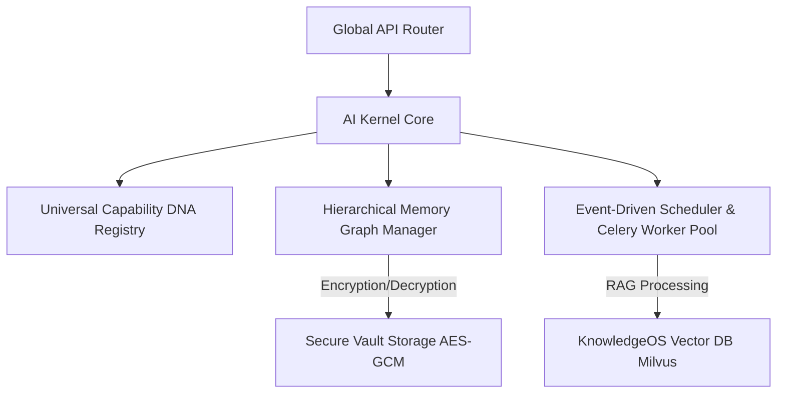

# NovaFlow AI Operating System (AIOS)
## Enterprise Production Specification (v12.2 Edition)

This document is the official, binding enterprise specification for the implementation of the NovaFlow AI Operating System (AIOS). It expands the 36-phase roadmap into concrete, actionable engineering blueprints.

---

## Program-Level Architecture & Vault Integrations



---

## Phase Group 1: Core AIOS Control Plane (Phases 1-4)

### 1. Executive Summary & Goals
Establish the bootloader control plane and capabilites vault. This block initializes the universal router, metadata registries, and capability parameters.

### 2. Scope & Out of Scope
* **In Scope**: Bootloader router, capability DNA schema model class, and default registry records.
* **Out of Scope**: Dynamic code generation (Phase 11) or sandbox runs (Phase 20).

### 3. Service Boundaries & API Contracts
* **Endpoint**: `GET /api/v1/aios/kernel/status`
  * *Request*: None (Bearer Auth header).
  * *Response Model*:
    ```json
    {
      "kernel_version": "12.2.0",
      "status": "active",
      "registered_capabilities_count": 22,
      "active_workers_count": 12
    }
    ```

### 4. Database & Cache Topology
* **New Table**: `aios_kernel_config`
  ```sql
  CREATE TABLE aios_kernel_config (
      id VARCHAR(36) PRIMARY KEY,
      active_provider_id INTEGER NOT NULL,
      heartbeat_interval INTEGER DEFAULT 30,
      updated_at TIMESTAMP DEFAULT CURRENT_TIMESTAMP ON UPDATE CURRENT_TIMESTAMP
  );
  ```
* **Redis Key**: `aios:kernel:status_heartbeat` (TTL: 60s).

### 5. Frontend & UI Changes
* **AI Providers Hub Settings Page**: Renamed from "Models & limits" tab. Displays provider connection tables, average latency logs, and token usage cards.
* **Context**: `LlmProviderContext` tracks selected routing rules and connected local models.

### 6. Testing & Compliance Plan
* **Unit Test**: Test if `list_provider_types` correctly returns all 22 registered providers.
* **Compliance**: Verify keys are masked before JSON output responses are sent to the client.

---

## Phase Group 2: Solution & Graph Compilers (Phases 5-15)

### 1. Executive Summary & Goals
Define the Project and Solution Graph databases and compilation pipelines. This block translates high-level business goals into node connection flows.

### 2. Scope & Out of Scope
* **In Scope**: `ProjectGraph` and `SolutionGraph` relational tables, Multi-agent coordinator logic.
* **Out of Scope**: Direct production deployment (Phase 22).

### 3. Service Boundaries & API Contracts
* **Endpoint**: `POST /api/v1/aios/project`
  * *Request Model*:
    ```json
    {
      "name": "Restaurant Order Bot",
      "goal": "Process menu selection via telegram and store orders in database"
    }
    ```
  * *Response Model*:
    ```json
    {
      "project_id": "proj_94b3c1",
      "solution_id": "sol_3c8d19",
      "status": "compiled_draft",
      "missing_credentials": ["telegram_bot_token"]
    }
    ```

### 4. Database Schema Extensions
* **Table**: `project_graphs`
  ```sql
  CREATE TABLE project_graphs (
      id VARCHAR(36) PRIMARY KEY,
      name VARCHAR(120) NOT NULL,
      business_goal TEXT NOT NULL,
      solution_payload JSON NOT NULL,
      version_tag VARCHAR(32) NOT NULL DEFAULT '1.0.0',
      created_at TIMESTAMP DEFAULT CURRENT_TIMESTAMP
  );
  ```

### 5. Celery Worker Tasks
* **Task Name**: `app.composer.tasks.compile_solution_graph`
  * *Parameters*: `project_id: str, goal: str`
  * *Behavior*: Asynchronously parses the prompt, matches capability registry patterns, and writes the Solution Graph configuration.

### 6. Testing & Compliance
* **Integration Test**: Asserts that sending a restaurant setup prompt generates a graph structure containing database tables and bot connection blocks.

---

## Phase Group 3: Sandboxed Simulation & Telemetry (Phases 16-24)

### 1. Executive Summary & Goals
Implement credential vault security and simulated Digital Twin runs to verify Solution Graphs prior to deployment.

### 2. Scope & Out of Scope
* **In Scope**: AES-GCM vault integrations, mock webhook injection, model failover handlers.
* **Out of Scope**: Publishing custom templates to the global marketplace (Phase 28).

### 3. Database Schema Extensions
* **Table**: `vault_secrets`
  ```sql
  CREATE TABLE vault_secrets (
      id VARCHAR(36) PRIMARY KEY,
      workspace_id INTEGER NOT NULL,
      secret_key VARCHAR(120) NOT NULL,
      secret_value_enc TEXT NOT NULL,
      created_at TIMESTAMP DEFAULT CURRENT_TIMESTAMP
  );
  ```

### 4. Failover & Self-Healing Logic
When an active LLM provider fails:
```python
async def route_with_failover(query: str, provider_chain: list[str]) -> str:
    for provider in provider_chain:
        try:
            return await execute_inference(query, provider)
        except Exception as exc:
            log_telemetry_failure(provider, str(exc))
    raise RuntimeError("All failover targets exhausted.")
```

### 5. Testing & Compliance
* **Security Test**: Validate that path traversal inputs (e.g. `../../etc/passwd`) inside agent file peeking scripts are intercepted and raise validation errors.

---

## Phase Group 4: Marketplace, Evolution & Governance (Phases 25-36)

### 1. Executive Summary & Goals
Establish continuous self-optimization, enterprise compliance monitoring, and final system-wide integration checks.

### 2. Scope & Out of Scope
* **In Scope**: SOC2/GDPR audit log tracing, self-refactoring evolutionary loops, and regression runs.
* **Out of Scope**: Support for non-standard local models.

### 3. Database Schema Extensions
* **Table**: `audit_events`
  ```sql
  CREATE TABLE audit_events (
      id BIGINT AUTO_INCREMENT PRIMARY KEY,
      workspace_id INTEGER NOT NULL,
      user_id INTEGER NOT NULL,
      action_type VARCHAR(64) NOT NULL,
      details TEXT,
      created_at TIMESTAMP DEFAULT CURRENT_TIMESTAMP
  );
  ```

### 4. Telemetry & Telemetry Dashboard Metrics
* **Latency Logs**: Track p95 execution latency metrics.
* **Token Counts**: Trace total tokens per session key.

### 5. Migration Plan
1. Apply SQL migrations using alembic.
2. Initialize default capability presets in the registry database.
3. Validate that legacy workflow graphs map cleanly as single-node Solution Graphs.

---

## Program-Level Risk Registry

| Risk ID | Description | Severity | Mitigation |
| :--- | :--- | :--- | :--- |
| **R-10** | High memory usage during webpack compiles on web build steps. | High | Utilize builder caches during Next.js compile loops. |
| **R-11** | Key leakage inside client response JSON objects. | Critical | Enforce pydantic output validation to strip API secrets. |
