# NovaFlow AI Operating System (AIOS)
## Permanent 36-Phase Implementation Roadmap & Architecture Audit

---

## 1. Architecture Coverage Report

| Subsystem / Section | Constitution Ref | Status | Existing System Reuse Target |
| :--- | :--- | :--- | :--- |
| **AI Kernel Core** | AIOS v12.1 | Missing | `app/runtime/` and `app/main.py` |
| **Capability DNA Registry** | AIOS v12.1 | Missing | `app/registry/` and `app/connectivity/` |
| **Universal Capability Registry** | AIOS v12.1 | Missing | `app/connectivity/` connections |
| **Universal Asset Registry** | AIOS v12.1 | Missing | `app/database.py` models mapping |
| **Project Graph Engine** | AIOS v12.1 | Missing | `app/database.py` schema extensions |
| **Solution Graph Engine** | AIOS v12.1 | Missing | `app/workflow_intelligence/` |
| **Hierarchical Memory Graph** | AIOS v12.1 | Missing | `app/conversation/` history store |
| **Component Reuse Engine** | AIOS v12.1 | Missing | `app/marketplace/` |
| **Gap Analysis Engine** | AIOS v12.1 | Missing | `app/workflow_intelligence/validation.py` |
| **Workflow Composer** | AIOS v12.1 | Partially Planned | `app/workflow_intelligence/compiler.py` |
| **Agent Composer** | AIOS v12.1 | Partially Planned | `app/agent_os/` |
| **Knowledge Composer** | AIOS v12.1 | Partially Planned | `app/knowledge_os/` |
| **Digital Twin Sandbox** | AIOS v12.1 | Missing | Celery docker subprocess runner |

---

## 2. Missing Architecture Report
The platform audit identified the following gaps between the legacy implementation and the v12.1 operating system model:
1. **Dynamic Solution Graphs**: Legacy system only generates workflows. The platform is missing the Solution Graph compilation abstraction layer.
2. **Hierarchical Memory Graph**: Lacks relational tracking for organization-level, workspace-level, and agent-level memory partitioning.
3. **Decoupled Sandbox Environment**: Currently no offline sandbox simulation matching third-party API mock vectors.

---

## 3. Dependency Graph

```mermaid
graph TD
    A[Phase 1: AI Kernel] --> B[Phase 2: Capability DNA]
    B --> C[Phase 3: Universal Capability Registry]
    C --> D[Phase 4: Universal Asset Registry]
    D --> E[Phase 5: Project Graph]
    E --> F[Phase 6: Solution Graph]
    F --> G[Phase 7: Hierarchical Memory]
    G --> H[Phase 8: Component Reuse Engine]
    H --> I[Phase 9: Workflow Fragment Registry]
    I --> J[Phase 10: Gap Analysis Engine]
    J --> K[Phase 11: Component Generator]
    K --> L[Phase 12: Workflow Composer]
    L --> M[Phase 13: Agent Composer]
    M --> N[Phase 14: Knowledge Composer]
    N --> O[Phase 15: Connector Composer]
    O --> P[Phase 16: Credential Intelligence]
    P --> Q[Phase 17: Business Ontology Engine]
    Q --> R[Phase 18: Resource Planner]
    R --> S[Phase 19: Resource Scheduler]
    S --> T[Phase 20: Digital Twin Sandbox]
    T --> U[Phase 21: Automatic Testing]
    U --> V[Phase 22: Deployment Manager]
    V --> W[Phase 23: Runtime Optimizer]
    W --> X[Phase 24: Self Healing Engine]
    X --> Y[Phase 25: Pattern Mining Engine]
    Y --> Z[Phase 26: Learning Engine]
    Z --> AA[Phase 27: Evolution Engine]
    AA --> AB[Phase 28: Marketplace Intelligence]
    AB --> AC[Phase 29: Governance Engine]
    AC --> AD[Phase 30: Digital Employee Framework]
    AD --> AE[Phase 31: Event Intelligence]
    AE --> AF[Phase 32: Monitoring Extensions]
    AF --> AG[Phase 33: Documentation Gen]
    AG --> AH[Phase 34: Migration & Compatibility]
    AH --> AI[Phase 35: Final Integration]
    AI --> AJ[Phase 36: Enterprise QA Testing]
```

---

## 4. Phase Dependency Matrix
Every phase is blocked by its corresponding preceding phase target. For instance:
* **Phase 6 (Solution Graph)** depends on **Phase 5 (Project Graph)** and **Phase 4 (Asset Registry)**.
* **Phase 20 (Digital Twin Sandbox)** depends on **Phase 19 (Resource Scheduler)** and **Phase 16 (Credential Intelligence)**.

---

## 5. Final 36-Phase Implementation Roadmap

### Phase 1: AI Kernel
* **Purpose**: Core orchestration router and lifecycle manager.
* **Database Changes**: Create table `ai_kernel_configurations`.
* **APIs to Create**: `/api/v1/aios/kernel/status`.
* **Testing Strategy**: Mock FastAPI requests to trace router health status.

### Phase 2: Capability DNA Registry
* **Purpose**: Stores operational parameters and constraints for capabilities.
* **Files to Create**: `backend/app/composer/registry/dna.py`.
* **Testing Strategy**: Assert capability templates parse correctly.

### Phase 3: Universal Capability Registry
* **Purpose**: Registers active capabilities across tenant spaces.
* **Database Changes**: Create table `universal_capabilities`.
* **Testing Strategy**: DB validation check on duplicate ID registrations.

### Phase 4: Universal Asset Registry
* **Purpose**: Indexes workflows, dashboards, and prompt templates.
* **Files to Create**: `backend/app/composer/registry/assets.py`.

### Phase 5: Project Graph
* **Purpose**: Root abstraction mapping goals to solution spaces.
* **Database Changes**: Create table `project_graphs`.

### Phase 6: Solution Graph
* **Purpose**: Renders the complete node graph of agents, workflows, and databases.
* **Database Changes**: Create table `solution_graphs`.

### Phase 7: Hierarchical Memory Graph
* **Purpose**: Partitions context logs from global space down to agent conversation logs.
* **Database Changes**: Create table `hierarchical_memories`.

### Phase 8: Component Reuse Engine
* **Purpose**: Matches goals to templates to prevent rebuild loops.
* **Testing Strategy**: Assert that exact match scenarios reuse matching templates.

### Phase 9: Workflow Fragment Registry
* **Purpose**: Indexes reusable sub-graphs of node DAGs.

### Phase 10: Gap Analysis Engine
* **Purpose**: Identifies missing credentials or schema parameters.

### Phase 11: Universal Component Generator
* **Purpose**: Autonomously writes, runs, and registers missing capabilities.
* **Files to Create**: `backend/app/composer/generator.py`.

### Phase 12: Workflow Composer
* **Purpose**: Child compiler that compiles node edges into execution flows.

### Phase 13: Agent Composer
* **Purpose**: Resolves single/multi-agent task splits.

### Phase 14: Knowledge Composer
* **Purpose**: Triggers document OCR, parsing, and vector indexing.

### Phase 15: Connector Composer
* **Purpose**: Configures webhook URLs and authentications.

### Phase 16: Credential Intelligence
* **Purpose**: Encrypts and masks key vault strings using HSM/AES keys.

### Phase 17: Business Ontology Engine
* **Purpose**: Autonomously parses industry-specific rules and processes.

### Phase 18: Resource Planner
* **Purpose**: Estimates VRAM, worker thread, and queue capacity metrics.

### Phase 19: Resource Scheduler
* **Purpose**: Enqueues batch, realtime, and cron jobs.

### Phase 20: Digital Twin Sandbox
* **Purpose**: Launches virtual mock runs containing simulated errors.

### Phase 21: Automatic Testing Engine
* **Purpose**: Generates and runs pipeline simulation tests.

### Phase 22: Deployment Manager
* **Purpose**: deploys Solution Graphs to target container hosts.

### Phase 23: Runtime Optimizer
* **Purpose**: Dynamically adjusts model routes to save token counts.

### Phase 24: Self Healing Engine
* **Purpose**: Automatically handles fallback transitions when APIs timeout.

### Phase 25: Pattern Mining Engine
* **Purpose**: Mine telemetry logs for workflow routing template updates.

### Phase 26: Learning Engine
* **Purpose**: Generalizes structural solutions securely without PII leaks.

### Phase 27: Evolution Engine
* **Purpose**: Automatically refactors sub-optimal logic flows.

### Phase 28: Marketplace Intelligence
* **Purpose**: Scans third-party components for security policies before publishing.

### Phase 29: Governance Engine
* **Purpose**: Enforces GDPR deletion hooks and SOC2 audit traces.

### Phase 30: Digital Employee Framework
* **Purpose**: Assigns KPIs, roles, and authorization scopes to agents.

### Phase 31: Event Intelligence
* **Purpose**: Transforms execution logs into structural improvements patterns.

### Phase 32: Monitoring & Observability Extensions
* **Purpose**: Collects sub-second latency telemetry and token spends.

### Phase 33: Documentation Generator
* **Purpose**: Autonomously updates markdown guides for deployed solutions.

### Phase 34: Migration & Compatibility Layer
* **Purpose**: Integrates legacy workflow graphs with the new Solution Graph schemas.

### Phase 35: Final Integration
* **Purpose**: Integrates the frontend client dashboard controls with the AIOS Kernel router.

### Phase 36: Enterprise Regression Testing
* **Purpose**: Execute full sandbox runs across all 22 preset capabilities.

---

## 6. Risk Register

| Risk ID | Description | Severity | Mitigation |
| :--- | :--- | :--- | :--- |
| **R-01** | Database lock contention during high-frequency memory graph updates. | High | Implement Redis caching ahead of DB write pools. |
| **R-02** | Sandbox environment escaping via unauthorized shell executions. | Critical | Enforce strict path validation checks inside `verify_password` and tools. |

---

## 7. Migration & Rollback Strategy
* **Migration**: Running `alembic upgrade head` populates new graph tables.
* **Rollback**: Every project graph revision is versioned. Toggling back immediately points system routers to the previous healthy revision ID.

---

## 8. Testing Matrix
Every phase incorporates:
1. **Mock Unit Tests** for verification validation.
2. **Integration Verification** via sandboxed simulated execution runs.

---

## 9. Implementation Order Justification
We build the **AI Kernel** and **Capability Registries** first because they provide the core routes and configuration metadata dependencies needed for compiling Solution Graphs and running Digital Twin sandboxes.

---

## 10. Future Expansion Notes
Future capability additions require only registering their schema parameters in the Capability DNA registry. The Universal Planner will discover and connect them automatically during planning compilation loops.
