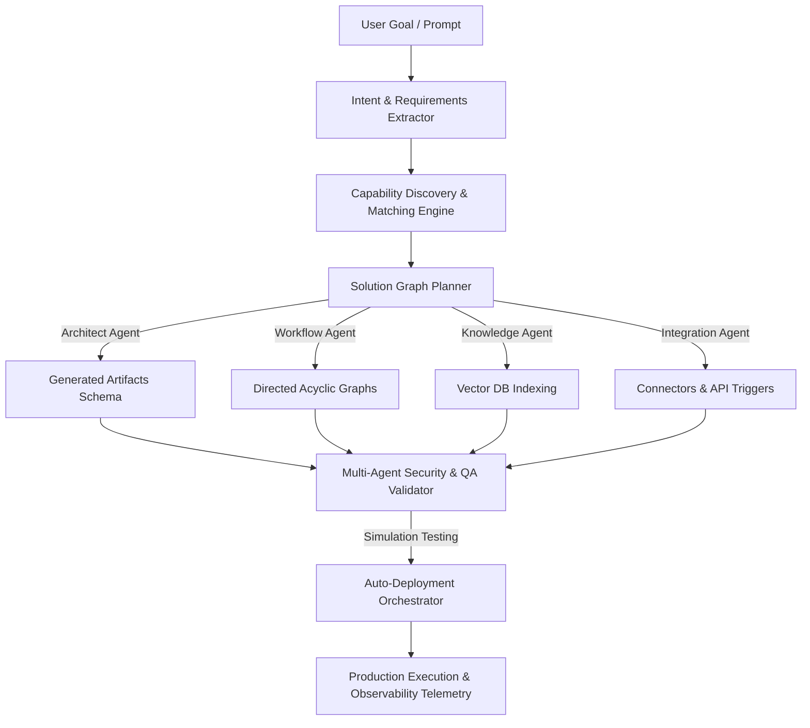

# NovaFlow AI: Universal System Builder Architecture
### Core Engineering Design Specification & Constitution

---

## 1. Executive Summary & Core Philosophy
NovaFlow is an **autonomous business operating system**. Rather than requiring human operators to manually design workflows, configure agents, construct databases, or map API integrations, the platform uses a **Goal-Driven Intent Engine**. 

The user describes a target business problem or operational outcome in natural language, and NovaFlow autonomously designs, validates, tests, deploys, and monitors the target solution.



---

## 2. Intent and Requirement Extraction Pipeline

When a goal (e.g., *"I want an automated HR onboarding system that indexes employee passports, creates slack accounts, and sends documents for signature"*) is submitted, the request progresses through a multi-stage compilation pipeline:

```
[User Prompt]
      │
      ▼
[Intent Parsing] ────────► Extracts primary business objectives and domain tags
      │
      ▼
[Requirement Extraction] ─► Isolates rules, documents, and credentials needed
      │
      ▼
[Capability Mapping] ────► Cross-references the live platform capabilities registry
      │
      ▼
[Gap Analysis] ──────────► Identifies missing inputs, routes, or APIs
      │
      ▼
[Solution Graph Generation]
```

### Automatic Requirement Checklist
Instead of failing when key details are missing, the system identifies the dependency and asks target questions. For example:
* *Missing:* Telegram connection details.
* *Action:* Prompt user with: *"Please provide your Telegram Bot Token to proceed with bot creation."*

---

## 3. The Solution Graph Paradigm
A **Solution Graph** is the unified structural representation of the deployed solution. It encapsulates more than just a workflow node graph:

```json
{
  "solution_id": "sol_94b38d",
  "goal": "Automated Restaurant Ordering Bot",
  "components": {
    "agents": [
      {
        "id": "agent_menu_responder",
        "role": "Conversational Ordering Assistant",
        "system_prompt": "You are a customer service assistant mapping order intents..."
      }
    ],
    "workflows": [
      {
        "id": "wf_payment_processing",
        "trigger": "webhook_event",
        "steps": ["Validate Cart", "Process Payment Link", "Send Receipt"]
      }
    ],
    "databases": [
      {
        "schema_name": "orders",
        "fields": ["id", "customer_name", "items", "status", "total_price"]
      }
    ],
    "integrations": [
      {
        "provider": "Stripe (BYO Key)",
        "purpose": "Payment endpoint processing"
      }
    ]
  }
}
```

---

## 4. Multi-Agent Solution Generation Engine
To prevent monolithic LLM prompts from failing on complex planning tasks, NovaFlow divides responsibilities among specialized micro-agents:

1. **Planner Agent**: Parses goals, identifies the business domain, and performs capability mapping.
2. **Architect Agent**: Generates the component schema, databases, and background worker queues.
3. **Workflow Agent**: Connects nodes, handles conditional branches, and routes logic flows.
4. **Integration Agent**: Configures connector parameters, webhooks, and endpoint mappings.
5. **Security & Reviewer Agent**: Evaluates the solution against compliance policies and validates sandbox execution constraints.

---

## 5. Self-Validation & Simulated Testing
No Solution Graph is permitted to reach the active deployment state without passing automated validation:
* **Structural Linting**: Verifies node connection completeness and avoids loop deadlocks.
* **Sandbox Verification**: Simulates execution runs with mock payloads to verify connector schemas and response structures.
* **Permissions Check**: Validates that all file accesses and shell execution arguments are isolated within safe workspace paths.

---

## 6. Background Processing & Intelligent Documents
Large-scale tasks execute asynchronously:
* **Background Worker Pools**: 10GB document uploads, vector embedding generation, and media indexing are processed in Celery background queues to prevent chat blocking.
* **Intelligent Document Classifier**: When files (PDFs, CSVs, Excel logs) are dropped into the workspace, the system automatically analyzes their contents to decide whether to:
  * Parse and chunk them for KnowledgeOS vector storage.
  * Map them as data tables inside relational models.
  * Treat them as datasets for fine-tuning routing models.
