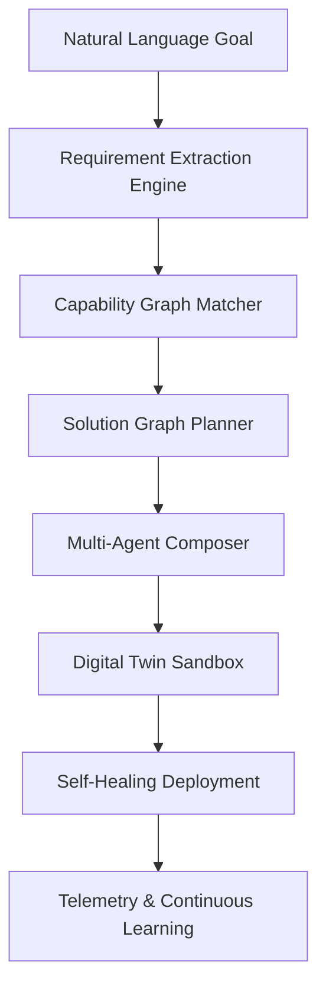
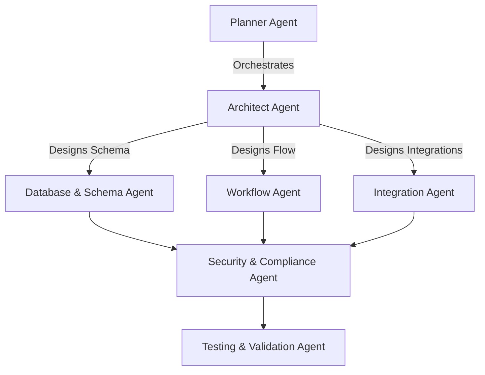
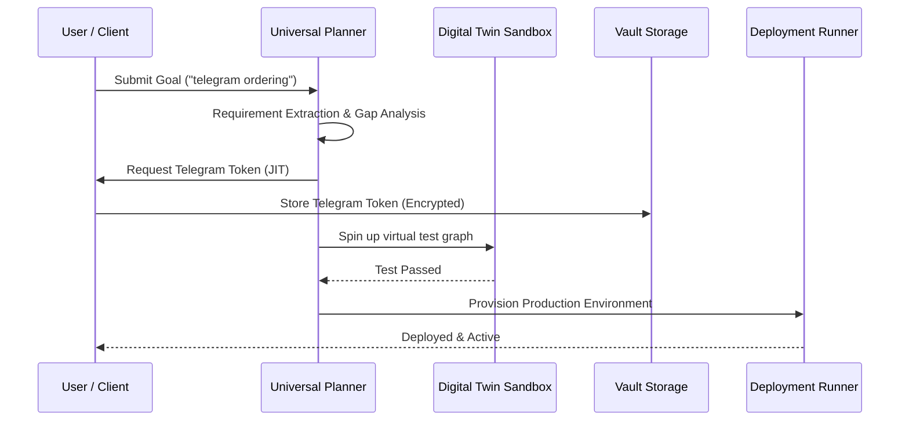
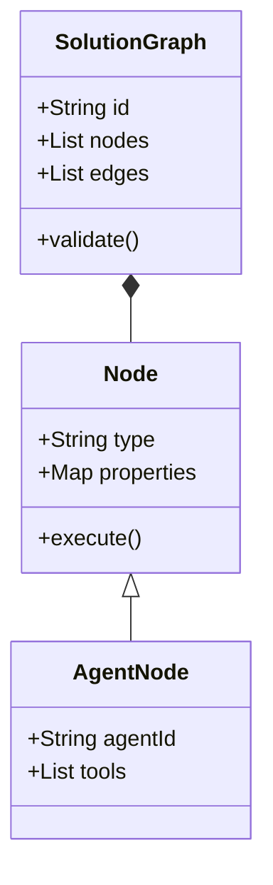

# NovaFlow AI: Universal System Builder Constitution
### Enterprise Architectural Blueprint (Production Edition v12.0)

---

## 1. AI Operating System Constitution
This Constitution establishes the core architecture of **NovaFlow AI OS**. NovaFlow is a goal-oriented AI Operating System that converts natural language business goals into complete, testable, and deployable Solution Graphs.

### Core Principles
1. **Goal-First Declarative Composition**: The user describes a business problem in natural language; NovaFlow decides the topology, components, and execution strategies.
2. **Platform Reusability**: Existing capabilities are reused before generating new components.
3. **Decoupled Swappability**: Model routing, inference providers, and service modules remain fully decoupled and swappable.
4. **Isolated Enterprise Governance**: Tenant spaces, encrypted credential storage, and sandbox verification are enforced globally.

---

## 2. Universal Solution Composer Architecture
The Universal Solution Composer orchestrates requirement extraction, capability matching, code generation, sandboxing, and deployment.



---

## 3. Capability Graph Architecture
Every business requirement matches one or more capabilities in a Directed Acyclic Graph (DAG) format.

```
[Requirement: Receive Orders] ──► [Capability: Chat API/Telegram Trigger]
                                              │
                                              ▼
[Requirement: Store Order]   ──► [Capability: Database Transaction]
                                              │
                                              ▼
[Requirement: Notify Staff]  ──► [Capability: Slack Webhook / Push Notification]
```

---

## 4. Universal Registry Architecture
The Universal Registry tracks metadata, availability, inputs, and security schemas for all capabilities.

```json
{
  "capability_id": "cap_tg_trigger_v2",
  "category": "connectivity",
  "inputs": {
    "bot_token": "string (secret)",
    "allowed_chats": "array"
  },
  "outputs": {
    "message_text": "string",
    "chat_id": "integer"
  },
  "dependencies": ["lib_tg_client_v1"],
  "security": {
    "encryption_required": true,
    "mfa_bypass_allowed": false
  }
}
```

---

## 5. Component Reuse Engine
The Reuse Engine scans templates, fragments, and components prior to initiating any new generation tasks.

```
[New Goal Check] 
       │
       ├─► Check templates database ────► [Template Found: Re-instantiate]
       ├─► Check workflows registry ───► [Fragment Match: Import Node Set]
       └─► Check local agent skills ───► [Skill Match: Attach to Agent]
```

---

## 6. Solution Graph Engine
The Solution Graph defines the complete relationship of components in a declarative payload before compiling workflows or provisioning databases.

```json
{
  "graph_id": "sg_res_001",
  "nodes": {
    "db_orders": { "type": "relational_db", "schema": "orders" },
    "agent_waiter": { "type": "agent", "skills": ["menu_answering", "order_take"] },
    "wf_payment": { "type": "workflow", "id": "wf_stripe_pay" }
  },
  "edges": [
    { "source": "agent_waiter", "target": "db_orders", "type": "write" },
    { "source": "db_orders", "target": "wf_payment", "type": "trigger" }
  ]
}
```

---

## 7. Planner Architecture
The Universal Planner parses intents, performs gap analysis, identifies missing credentials, and generates the compilation strategy.

```
[User Input] ──► [Intent Classifier] ──► [Capability Mapping] ──► [Gap Analysis Check] ──► [Target Plan]
```

---

## 8. Multi-Agent Planning Architecture
NovaFlow distributes system composition across a team of specialized agents:



---

## 9. Digital Twin Sandbox
Before deployment, a virtual environment simulates inputs, API calls, and edge cases to verify the Solution Graph's stability.

```
[Generated Solution Graph] ──► [Provision Sandbox Containers]
                                       │
                                       ├─► Inject Mock Webhook Triggers
                                       ├─► Simulate Timeout/429 Errors
                                       └─► Trace Performance Bottlenecks
```

---

## 10. Credential Intelligence Architecture
Credentials are collected just-in-time, encrypted with AES-256-GCM, and isolated by workspace.

* **Encrypted Vault**: Symmetric encryption keys stored inside HSM modules.
* **Just-In-Time Prompts**: The planner builds the solution graph first, then prompts the user for credentials only when compiling the active integration pipeline.

---

## 11. Learning Engine Architecture
NovaFlow extracts successful structural patterns and optimizations to update its internal template library without exposing user-specific code or private tenant documents.

```
[Production Run Metrics] ──► [Filter out PII/Tenant Data] ──► [Anonymized Pattern Extraction] ──► [Template Updates]
```

---

## 12. Marketplace & Template Catalog
Allows workspaces to scan, publish, version, and clone pre-validated templates. A verification scanner checks third-party components for security, compliance, and latency policies before publishing.

---

## 13. Component Lifecycle
```
[Draft] ──► [Validated] ──► [Sandbox Test] ──► [Active / Deployed] ──► [Deprecating] ──► [Archived]
```

---

## 14. Workflow Lifecycle
Workflows exist as compiled nodes within a Solution Graph, transitioning from **Draft** to **Tested (Sandbox)**, **Active (Production)**, and **Rolled-Back** (in case of active execution anomalies).

---

## 15. Asset Lifecycle
Asset templates (prompts, dashboard configurations, knowledge vector partitions) follow identical version tags matched to the overall Solution Graph release ID.

---

## 16. Solution Composer APIs
* `POST /api/v1/compose/goal`: Submits a goal to initiate requirement extraction and capability matching.
* `GET /api/v1/compose/solution-graph/[id]`: Traces status, missing credentials list, and node graph structures.
* `POST /api/v1/compose/deploy/[id]`: Triggers sandbox verification and pushes to target production hosts.

---

## 17. Database Schema Extensions

```sql
CREATE TABLE solution_graphs (
    id VARCHAR(36) PRIMARY KEY,
    workspace_id INTEGER NOT NULL,
    goal TEXT NOT NULL,
    graph_payload JSON NOT NULL,
    status VARCHAR(32) NOT NULL DEFAULT 'draft',
    created_at TIMESTAMP DEFAULT CURRENT_TIMESTAMP
);

CREATE TABLE active_routing_rules (
    id VARCHAR(36) PRIMARY KEY,
    solution_id VARCHAR(36) NOT NULL,
    base_model VARCHAR(64) NOT NULL,
    failover_model VARCHAR(64) NOT NULL,
    max_retries INTEGER DEFAULT 3
);
```

---

## 18. Event Flow Topology
NovaFlow coordinates asynchronous operations via a Redis/RabbitMQ event bus:

```
[Webhook Event Received] ──► [Event Bus Broker] ──► [Orchestration worker] ──► [Agent Node] ──► [DB Commit]
```

---

## 19. Sequence Diagram (Composition & Deployment)



---

## 20. Workspace Folder Structure
```
novaflow-ai/
├── backend/
│   ├── app/
│   │   ├── composer/           # Solution Graph composition engines
│   │   ├── sandbox/            # Digital twin sandbox simulator
│   │   ├── services/           # Decoupled agent & model services
│   │   └── registry/          # Platform capabilities registry
```

---

## 21. Class Diagram (Solution Graph System)



---

## 22. Service Boundaries
* **Inference Service**: Handles LLM connections, proxying compatible requests, and token counts.
* **Celery Background Worker Pool**: Compiles documents, runs OCR, runs sandbox tests, and handles embeddings.
* **Orchestration API Server**: Manages workspace states, routing policies, and configuration settings.

---

## 23. Celery Background Worker Pipelines
* **`process_document_batch`**: Triggered when dropping files into KnowledgeOS. Performs automated OCR, metadata categorization, and vector storage updates.
* **`run_sandbox_simulation`**: Configures virtual containers to test Solution Graph dependencies.

---

## 24. Scheduler Design
A Celery Beat container handles cron triggers (e.g., daily sales summaries). It schedules tasks using the global event bus:

```
[Celery Beat Trigger] ──► [Enqueue Event] ──► [Celery Worker Execution]
```

---

## 25. Enterprise Governance Model
* **Tenant Isolation**: Separate DB partitions and namespace keys prevent cross-tenant data access.
* **Compliance Checks**: Compliance scanners trace data retention rules, checking passport logs or PII before archiving execution data.

---

## 26. Unified Security Model
* Encrypted credential keys are kept inside AES-GCM vault storage.
* Path normalization tools prevent file peeking or writing actions outside the `/app` project directory.

---

## 27. Versioning Strategy
Every Solution Graph revision generates a semantically versioned build (e.g., `v1.2.0`) mapped to database history records. The deployment runner allows users to roll back to any previous healthy release tag.

---

## 28. Automated Testing Strategy
When a Solution Graph is compiled, a test generation task compiles:
* **Mock integrations tests** to check external webhook payloads.
* **Assert validations** to test if the output matches expected JSON schemas.

---

## 29. Auto-Deployment & Rollback Strategy
If production health checks fail within 120 seconds of launching a Solution Graph deployment, the supervisor immediately triggers an automated rollback to the previous active release tag.

---

## 30. Future Expansion Strategy
The decoupled design ensures that adding new components (e.g., MCP tools or fine-tuned model routers) requires only registering their schema parameters in the **Global Capability Registry**. The Universal Planner will automatically discover and utilize them in future solution graphs.
